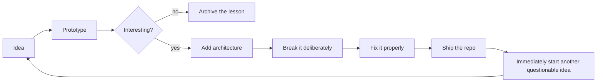

<p align="center">
  
</p>

<p align="center">
  <a href="https://github.com/ArhamChoudhary-ui?tab=repositories"></a>
  <a href="https://github.com/ArhamChoudhary-ui/FaultLine"></a>
</p>

```txt
booting arham.dev...
[ok] curiosity        online
[ok] build loop       online
[ok] questionable ideas promoted to prototypes
[ok] prototypes promoted to repositories
[ok] comfort zone     not found
```

# `whoami`

I’m **Arham Choudhary** — a builder who likes software that *does something visible*.

Not just CRUD screens.
Not just “AI-powered” labels.
Not just projects that stop at the demo.

I like systems you can poke, stress, break, inspect, recover, and understand.
That has taken me from **gesture-controlled interfaces** and **parking systems** to **review intelligence**, **academic tooling**, **assistant action recovery**, and now **developer forensics**.

My favorite question is usually:

> **“What would make this feel impossible the first time someone sees it?”**

---

## `signal / now`

```diff
+ building developer tooling that can explain what went wrong
+ experimenting with AI as a system component, not a sticker
+ obsessed with interfaces that make complex systems feel obvious
+ turning hackathon ideas into projects with actual architecture
- interested in making the 48th identical dashboard clone
```

---

## `case files`

### 01 // `FaultLine`
**Find the commit that broke it. Then prove it.**

Autonomous regression archaeology for software failures: isolated Git worktrees, bisection, counterfactual parent-vs-culprit execution, blast-radius analysis, and a red-green repair workflow.

`Node.js` `Git` `DevTools` `Forensics` `Agents`

[open case file →](https://github.com/ArhamChoudhary-ui/FaultLine)

---

### 02 // `Second Take`
**Preview, approve, change, recover.**

A software-only assistant action workspace built around booking recovery, exact approval, persistent action history, MCP tools, and safe handling of conflicting edits.

`React` `TypeScript` `Cloudflare Workers` `D1` `MCP`

[open case file →](https://github.com/ArhamChoudhary-ui/Second-Take)

---

### 03 // `ReviewIQ`
**Turn review noise into decisions.**

A review intelligence system for sentiment, aspect mining, trends, competitor comparison, search, analytics, and generated business summaries.

`Python` `FastAPI` `Transformers` `RoBERTa` `Llama 3`

[open case file →](https://github.com/ArhamChoudhary-ui/ReviewIQ)

---

### 04 // `Academic Tracker`
**Make marks measurable before they become surprises.**

A private browser-first academic tracker with weighted internals, target-score calculation, GPA/consistency views, charts, study sessions, CSV export, and optional encrypted sync.

`React` `Tailwind` `Vite` `Recharts` `localStorage`

[open case file →](https://github.com/ArhamChoudhary-ui/Academic-Tracker)

---

### 05 // `AI Virtual Gesture Keyboard`
**Type without touching the keyboard.**

Real-time hand tracking with pinch-to-click interaction, a custom virtual keyboard UI, and gesture-driven text input.

`Python` `OpenCV` `CVZone` `Pynput`

[open case file →](https://github.com/ArhamChoudhary-ui/AI-Virtual-Gesture-Controlled-Keyboard)

---

### 06 // `Smart Parking Lot Management System`
**One problem, multiple interfaces.**

A parking operations system spanning a Qt desktop app, browser frontend, and Python utilities for occupancy, entry/exit, billing, transaction history, and reporting.

`C++17` `Qt` `JavaScript` `Vite` `Python`

[open case file →](https://github.com/ArhamChoudhary-ui/Smart-Parking-Lot-Management-System)

---

## `stack.trace()`

```yaml
languages:
  - JavaScript / TypeScript
  - Python
  - C++

systems_i_keep_reaching_for:
  - React + Vite
  - Node.js
  - FastAPI
  - Git internals
  - Cloudflare Workers + D1
  - OpenCV / computer vision
  - local-first browser storage
  - LLM / NLP pipelines

things_i_care_about:
  - developer experience
  - debugging & observability
  - interaction design
  - automation
  - reproducible systems
  - demos that actually work
```

---

## `operating principles`

```txt
01. build the weird version first
02. make the demo undeniable
03. hide complexity, not capability
04. if AI is involved, give it a real job
05. tests are part of the product story
06. if it breaks, leave evidence
07. if it works, make it understandable
```

---

## `repo topology`



---

## `small print`

I’m still learning, which is exactly why the repositories keep changing.

Some projects are polished.
Some are experiments.
Some exist because I wanted to know whether an idea could be made real before common sense arrived.

That’s the point.

<p align="center">
  <b>source available. curiosity non-optional.</b>
</p>

<p align="center">
  <code>status: building something</code>
</p>
