  

 

## `whoami`
I'm **Arham Choudhary** — I build software that *does something visible*.
Not CRUD screens. Not "AI-powered" as a sticker. Not projects that stop at the demo. I like systems you can poke, stress, break, inspect, recover, and actually understand — which is how I ended up moving between gesture interfaces, parking systems, review intelligence, academic tooling, and now developer forensics.
The question I keep coming back to: **what would make this feel impossible the first time someone sees it?**
 

## `ps aux`
Everything currently mounted, sorted by how much of my attention it's eating.

<table width="100%">
<tr>
<td width="34%" valign="top">
**`faultline`** &nbsp;·&nbsp; 🟠 active  
Find the commit that broke it — then prove it. Isolated Git worktrees, bisection, counterfactual parent-vs-culprit runs, blast-radius analysis, red-green repair.  
`Node.js` `Git internals` `Agents`  
[**→ open**](https://github.com/ArhamChoudhary-ui/FaultLine)
</td>

<td width="33%" valign="top">
**`second-take`** &nbsp;·&nbsp; 🟠 active  
Preview, approve, change, recover. An assistant-action workspace built around booking recovery, exact approval, and safe handling of conflicting edits.  
`React` `TypeScript` `Workers` `D1` `MCP`  
[**→ open**](https://github.com/ArhamChoudhary-ui/Second-Take)
</td>

<td width="33%" valign="top">
**`reviewiq`** &nbsp;·&nbsp; 🟠 active  
Turn review noise into decisions. Aspect mining, sentiment, trends, competitor comparison, generated business summaries.  
`Python` `FastAPI` `RoBERTa` `Llama 3`  
[**→ open**](https://github.com/ArhamChoudhary-ui/ReviewIQ)
</td>
</tr>

<tr>
<td valign="top">
**`academic-tracker`** &nbsp;·&nbsp; 🟣 sleeping  
Make marks measurable before they become surprises. Weighted internals, target-score math, GPA views, encrypted sync.  
`React` `Vite` `Recharts` `local-first`  
[**→ open**](https://github.com/ArhamChoudhary-ui/Academic-Tracker)
</td>

<td valign="top">
**`gesture-keyboard`** &nbsp;·&nbsp; 🟣 sleeping  
Type without touching a keyboard. Real-time hand tracking, pinch-to-click, a custom virtual keyboard driven entirely by gestures.  
`Python` `OpenCV` `CVZone`  
[**→ open**](https://github.com/ArhamChoudhary-ui/AI-Virtual-Gesture-Controlled-Keyboard)
</td>

<td valign="top">
**`smart-parking`** &nbsp;·&nbsp; 🟣 sleeping  
One problem, three interfaces. A Qt desktop app, a browser frontend, and Python tooling over the same occupancy and billing core.  
`C++17` `Qt` `Vite` `Python`  
[**→ open**](https://github.com/ArhamChoudhary-ui/Smart-Parking-Lot-Management-System)
</td>
</tr>
</table>
 

## `lsmod`

 

## `sh` — this part actually runs
These aren't decorative. Each one opens a pre-filled issue on this repo. Fill it in, submit, and it lands in my inbox.

 

## `top`

 

## `tree /`

&nbsp;<code>/dev</code> &nbsp;— what's plugged in

 
<pre>
/dev/curiosity      → primary input device, cannot be unmounted
/dev/build-loop     → idea in, repository out
/dev/null           → where the 48th identical dashboard clone goes
/dev/comfort-zone   → device not found
</pre>

&nbsp;<code>/etc/principles</code> &nbsp;— how I decide things

 
<pre>
build the weird version first
make the demo undeniable
hide complexity, not capability
if AI is involved, give it a real job
tests are part of the product story
if it breaks, leave evidence
if it works, make it understandable
</pre>

&nbsp;<code>/proc/pipeline</code> &nbsp;— how a repo gets made

 
<pre>
mermaid
graph LR
    A[Idea] --> B[Prototype]
    B --> C{Interesting?}
    C -- no --> D[Archive the lesson]
    C -- yes --> E[Add architecture]
    E --> F[Break it deliberately]
    F --> G[Fix it properly]
    G --> H[Ship the repo]
    H --> A
</pre>

&nbsp;<code>/var/log/honest.log</code> &nbsp;— the unpolished part

 
<pre>
warn  some of these repos are experiments, not products
warn  some exist only because I wanted to know if the idea
      could survive contact with reality
warn  I am still learning, which is exactly why the
      repositories keep changing
info  that is the point
</pre>

 

## `git log --graph`

  <picture>
    <source media="(prefers-color-scheme: dark)" srcset="https://raw.githubusercontent.com/ArhamChoudhary-ui/ArhamChoudhary-ui/output/github-contribution-grid-snake-dark.svg">
    <source media="(prefers-color-scheme: light)" srcset="https://raw.githubusercontent.com/ArhamChoudhary-ui/ArhamChoudhary-ui/output/github-contribution-grid-snake.svg">
    
  </picture>

 

<code>shutdown -h now</code> &nbsp;·&nbsp; source available, curiosity non-optional

