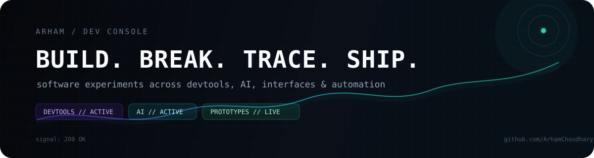

# Arham Choudhary — Profile Console

  

  
  
  

  <code>status: building something</code>
  <code>·</code>
  <code>comfort zone: not found</code>
  <code>·</code>
  <code>curiosity: online</code>

## 🖥️ Enter the console

<b>▶ boot sequence — click to expand</b>

~~~text
$ ./arham --boot

[ OK ] loading curiosity......................... done
[ OK ] mounting devtools........................ done
[ OK ] indexing unfinished ideas................. 17 found
[ OK ] checking comfort zone.................... not found
[ OK ] starting build → break → trace → ship.... live

identity:  Arham Choudhary
mode:      systems builder
focus:     interfaces that make intelligent systems feel human
location:  India
~~~

<b>▶ whoami — the human behind the repositories</b>

I’m **Arham Choudhary** — a builder who likes software you can poke, stress, break, inspect, recover, and understand.

I move between **developer tooling**, **AI/ML systems**, **interactive interfaces**, and **product experiments**. My projects are less about collecting technologies and more about asking:

> **What would make this feel impossible the first time someone sees it?**

## 🧭 Navigate the system

| Route | What you’ll find |
|---|---|
| [🧠 Intelligence Lab](#-intelligence-lab) | Review intelligence, NLP, computer vision, and AI-assisted workflows |
| [🧰 Developer Forensics](#-developer-forensics) | Regression archaeology, evidence, tests, and repair workflows |
| [🪄 Product Experiments](#-product-experiments) | Human-safe assistant actions, academic tooling, and real-world systems |
| [📡 Live telemetry](#-live-telemetry) | GitHub activity and repository signals |

## 🧰 Case files

> Six projects. One recurring obsession: make complicated systems understandable.

<table>
<tr>
<td width="50%" valign="top">

### <code>01</code> · FaultLine

**Find the commit that broke it. Then prove it.**

Autonomous regression archaeology with isolated Git worktrees, binary bisection, counterfactual parent-vs-culprit execution, blast-radius analysis, and red-green repair.

<code>Node.js</code> <code>Git</code> <code>DevTools</code> <code>Forensics</code>

<a href="https://github.com/ArhamChoudhary-ui/FaultLine">open the case file →</a>

</td>
<td width="50%" valign="top">

### <code>02</code> · Second Take

**Preview. Approve. Recover.**

An assistant-action workspace for booking recovery, exact approval, persistent history, MCP tools, and safe handling of conflicting edits.

<code>React</code> <code>TypeScript</code> <code>Workers</code> <code>D1</code> <code>MCP</code>

<a href="https://github.com/ArhamChoudhary-ui/Second-Take">open the case file →</a>

</td>
</tr>
<tr>
<td width="50%" valign="top">

### <code>03</code> · ReviewIQ

**Turn review noise into decisions.**

Sentiment analysis, aspect mining, trend analytics, competitor comparison, search, reports, and business-facing summaries.

<code>Python</code> <code>FastAPI</code> <code>RoBERTa</code> <code>Llama 3</code>

<a href="https://github.com/ArhamChoudhary-ui/ReviewIQ">open the case file →</a>

</td>
<td width="50%" valign="top">

### <code>04</code> · Academic Tracker

**Make marks measurable before they become surprises.**

A private browser-first academic workspace with weighted internals, target-score calculation, GPA views, charts, study sessions, CSV export, and optional encrypted sync.

<code>React</code> <code>Tailwind</code> <code>Vite</code> <code>Recharts</code>

<a href="https://github.com/ArhamChoudhary-ui/Academic-Tracker">open the case file →</a>

</td>
</tr>
<tr>
<td width="50%" valign="top">

### <code>05</code> · Gesture Keyboard

**Type without touching the keyboard.**

Real-time hand tracking, pinch-to-click interaction, custom virtual keys, and gesture-driven text input.

<code>Python</code> <code>OpenCV</code> <code>CVZone</code> <code>Pynput</code>

<a href="https://github.com/ArhamChoudhary-ui/AI-Virtual-Gesture-Controlled-Keyboard">open the case file →</a>

</td>
<td width="50%" valign="top">

### <code>06</code> · Smart Parking

**One problem. Multiple interfaces.**

A Qt desktop app, browser frontend, and Python tooling for occupancy, entry/exit, billing, transactions, and reporting.

<code>C++17</code> <code>Qt</code> <code>JavaScript</code> <code>Python</code>

<a href="https://github.com/ArhamChoudhary-ui/Smart-Parking-Lot-Management-System">open the case file →</a>

</td>
</tr>
</table>

## 🧠 Intelligence Lab

<b>open /intelligence-lab</b>

- **ReviewIQ** — extracting business meaning from customer review data with NLP.
- **Gesture Keyboard** — turning computer vision landmarks into a usable input surface.
- **Academic Tracker** — keeping useful analysis local, private, and immediately actionable.

The common thread: intelligence is only useful when it changes what a person can do next.

## 🧰 Developer Forensics

<b>open /developer-forensics</b>

FaultLine is the clearest expression of how I like to build:

1. Reproduce the failure.
2. Narrow the suspect history.
3. Execute parent and culprit revisions.
4. Prove causality with evidence.
5. Map the blast radius.
6. Repair it and verify the repair.

No “the model thinks this might be the issue” hand-waving. The system should leave a trail.

## 🪄 Product Experiments

<b>open /product-experiments</b>

Second Take explores a simple idea: assistant actions should be **previewable, editable, recoverable, and safe**.

Academic Tracker and Smart Parking explore the same principle from different directions: make the state of a system visible before the user has to guess.

## ⚡ Stack trace

~~~yaml
languages:
  - JavaScript / TypeScript
  - Python
  - C++

systems:
  - React + Vite
  - Node.js
  - FastAPI
  - Git internals
  - Cloudflare Workers + D1
  - OpenCV / computer vision
  - local-first browser storage
  - LLM / NLP pipelines

design instincts:
  - make the complex legible
  - make the demo undeniable
  - give AI a real job
  - leave evidence when things break
  - ship the weird version first
~~~

<b>show the operator manual</b>

~~~text
01. build the weird version first
02. make the demo undeniable
03. hide complexity, not capability
04. if AI is involved, give it a real job
05. tests are part of the product story
06. if it breaks, leave evidence
07. if it works, make it understandable
~~~

## 📡 Live telemetry

<b>expand live GitHub signals</b>

  
  

  

## 🛰️ Transmission

If you’re exploring the repositories, start with **[FaultLine](https://github.com/ArhamChoudhary-ui/FaultLine)** for the engineering story, **[Second Take](https://github.com/ArhamChoudhary-ui/Second-Take)** for the product story, or **[My Portfolio](https://github.com/ArhamChoudhary-ui/My-portfolio)** for the visual story.

   
  <b>source available · curiosity non-optional</b>
    
  <code>made in India // shipped to the internet</code>

